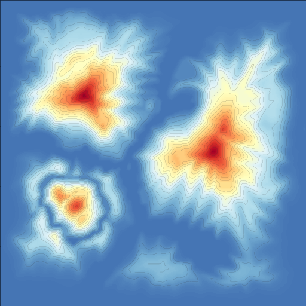
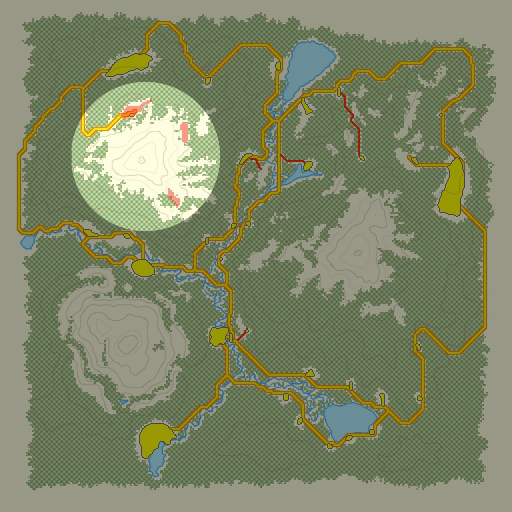
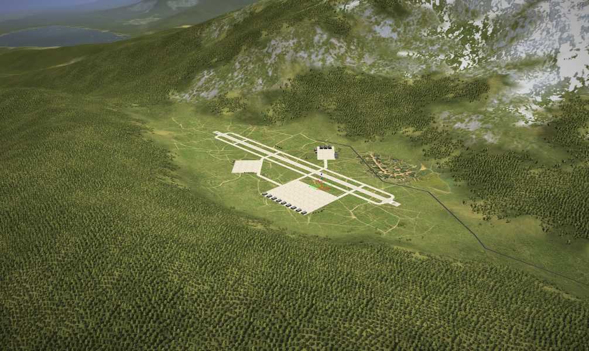

IL-2 FB Flatland Detector
#########################

|pypi_package| |python_versions| |license|

**Table of Contents**

.. contents::
    :local:
    :backlinks: none

Synopsis
========

Flatland Detector is an application which detects flatlands suitable for
placing groups of objects on locations of «IL-2 Sturmovik: Forgotten Battles»
flight simulator.

It takes heightmaps of a locations in form of 2D matrix of heights and searches
for flat convex areas which are clusters of adjacent points with same values.
Binary data is produced by `il2fb-heightmap-creator <https://github.com/IL2HorusTeam/il2fb-heightmap-creator>`_
and it contains 2-byte integer values with resolution of heights up to 1 meter.

For example, there is a map with size of 51.2 × 51.2 km:

.. image:: ./examples/map.png
   :align: center

Its heightmap is contained in ``examples/heightmap.raw`` file. This heighmap
can be rendered into the following image:

The goal of Flatland Detector is to find flat areas which are big enough for
placing airfields, warehouses, factories and other complex objects on them.

The image below shows a highlighted area of map with imprinted red areas which
stand for flatlands used for placement of 2 airfields and 1 village.

Example of an airbase which is placed one of that flatlands is shown below.

Flatland Detector allows to find such flatlands, save them in binary format and
to imprint them in maps.

.. |pypi_package| image:: http://img.shields.io/pypi/v/il2fb-flatland-detector.svg?style=flat
   :target: https://pypi.python.org/pypi?name=il2fb-flatland-detector&:action=display

.. |python_versions| image:: https://img.shields.io/badge/Python-3.6-brightgreen.svg?style=flat
   :alt: Supported versions of Python

.. |license| image:: https://img.shields.io/badge/license-MIT-blue.svg?style=flat
   :target: https://github.com/IL2HorusTeam/il2fb-flatland-detector/blob/master/LICENSE
   :alt: MIT license
